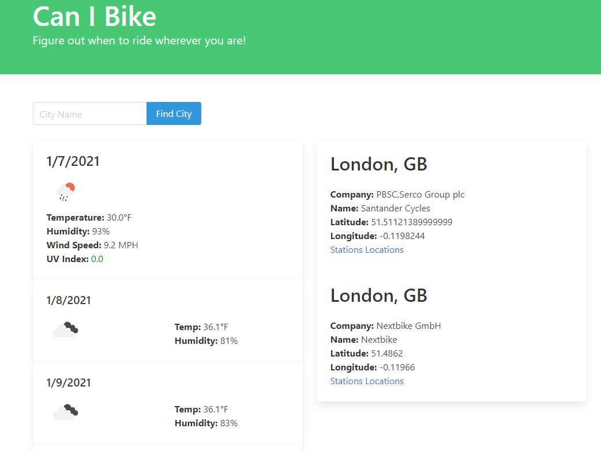

# Can-I-Bike

## Description

* As a biker, I want to know the weather and the amount of rentable bikes in an area I am traveling to, as well as where the bikes can be picked up.
* When I search a city name, I am given the weather in the city and companies that rent bikes in the area
* When I look for more information about the companies that rent bikes, I am given the stations in the city where bikes are rented and more information about them

## Reasources Used

* HTML
* JavaScript
* CSS framework called Bulma
* Open Weather API and City Bikes API

## Site Deployed
[Can I Bike](https://hunterstrunk.github.io/can-i-bike/)

## Contribution
* Russ T
* Hunter S
* Skylar R

## Site Image

